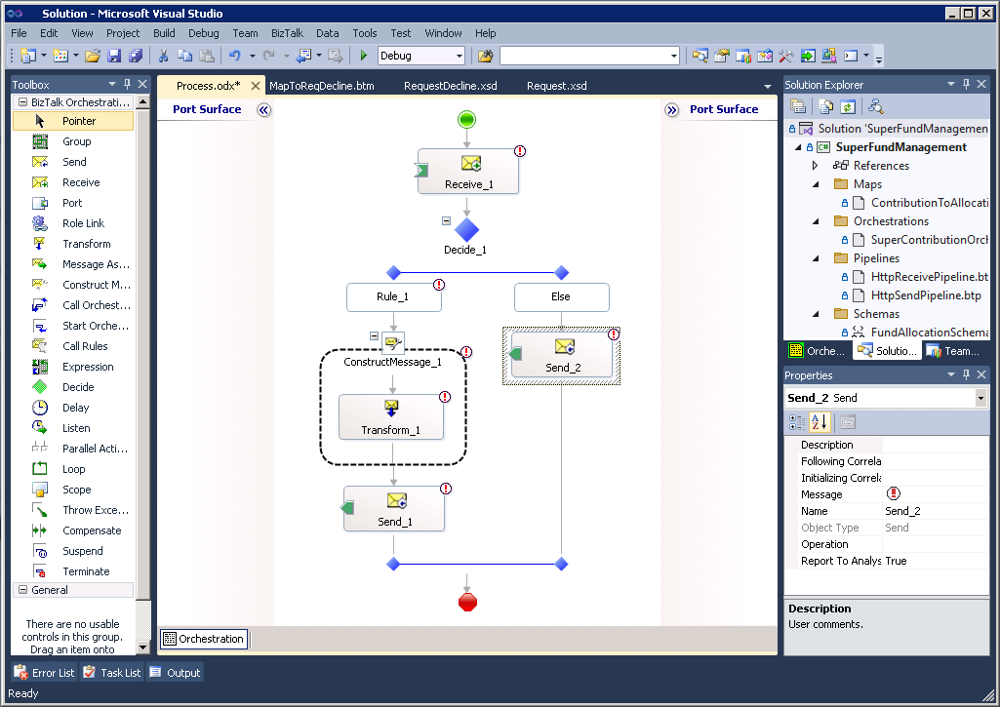

# BizTalk to Azure Functions Migration Demo

A complete, live demo repository for the **"GitHub Copilot: BizTalk to Azure Functions Migration"** demonstration. It shows how GitHub Copilot accelerates the migration of a legacy BizTalk Server 2020 integration to a cloud-native Azure Functions v4 (.NET 8) solution.

---

## Demo Scenario

A **Superannuation Fund Management** integration for a super company that:

1. **Receives** an HTTP POST with an XML `SuperContributionRequest` payload from an employer's payroll system
2. **Transforms** the payload from the legacy `SuperContributionRequest` format to the modern `FundAllocationInstruction` format (equivalent to a BizTalk map with String Concatenate and constant functoids)
3. **Forwards** the transformed payload as XML to the downstream fund administration platform




---


## Current State: BizTalk Solution

> Requires BizTalk Server 2020 + Visual Studio 2022 with BizTalk extensions.

```bash
# Open in Visual Studio
start biztalk/SuperFundManagement.sln

# Build
msbuild biztalk/SuperFundManagement.sln /p:Configuration=Release

# Deploy bindings after MSI install
BTSTask ImportBindings /ApplicationName:SuperFundManagement /Source:biztalk/SuperFundManagement/BindingFile.xml
```

See [biztalk/README.md](biztalk/README.md) for full deployment instructions.

## Future State: Azure Integration

### Deploy Infrastructure

```bash
az group create --name rg-super-fund-mgmt-dev --location australiaeast

az deployment group create \
  --resource-group rg-super-fund-mgmt-dev \
  --template-file bicep/main.bicep \
  --parameters bicep/main.bicepparam
```

See [bicep/README.md](bicep/README.md) for full deployment steps.


### Azure Functions App

> Requires .NET 8 SDK + Azure Functions Core Tools v4.

```bash
# Install dependencies
cd az/funcapp/SuperFundManagementFunc
dotnet restore

# Run locally (start Azurite first for local storage)
func start

# Test with curl
curl -X POST http://localhost:7071/api/contributions \
  -H "Content-Type: application/xml" \
  -d '<?xml version="1.0"?><SuperContributionRequest xmlns="http://SuperFundManagement.Schemas.SuperContribution"><ContributionId>CONT-2024-001</ContributionId><EmployerId>EMP-001</EmployerId><EmployerName>Acme Corporation Pty Ltd</EmployerName><EmployerABN>51824753556</EmployerABN><PayPeriodEndDate>2024-06-30</PayPeriodEndDate><Members><Member><MemberAccountNumber>SF-100001</MemberAccountNumber><MemberName>Jane Smith</MemberName><ContributionType>SuperannuationGuarantee</ContributionType><GrossAmount>875.00</GrossAmount></Member></Members><TotalContribution>875.00</TotalContribution><Currency>AUD</Currency><PaymentReference>PAY-REF-20240630</PaymentReference></SuperContributionRequest>'
```

Expected response:
```json
{ "allocationId": "FA-CONT-2024-001", "sourceContributionRef": "CONT-2024-001", "status": "PENDING" }
```

See [az/funcapp/README.md](az/funcapp/README.md) for full details.

### Run Tests

```bash
cd func
dotnet test SuperFundManagementFunc.sln --verbosity normal
```


---

## Documentation

| Document | Description |
|---|---|
| [docs/architecture.md](docs/architecture.md) | Current vs target architecture with ASCII diagrams |
| [docs/biztalk-orchestration.md](docs/biztalk-orchestration.md) | BizTalk solution deep-dive |
| [docs/migration-guide.md](docs/migration-guide.md) | Step-by-step migration guide |
| [docs/copilot-demo-script.md](docs/copilot-demo-script.md) | Live demo script with Copilot prompts |

---

## Demo

Use GitHub coding agent to create migration.


```
migrate Biztalk integration to Azure Functions
```

```
migrate existing BizTalk application inside `biztalk` folder to new integration app on Azure.

- create the integraiton logics as a c# function app inside `func`
- create tests for the integration inside `func`
- create IaC deployment for azure inside `bicep`

keep the init migration process simple and as it as

```


## Repository Structure

```
.
├── biztalk/                                # BizTalk Server 2020 source (the "before")
│   ├── SuperFundManagement.sln
│   └── SuperFundManagement/
│       ├── SuperFundManagement.btproj
│       ├── BindingFile.xml                 # Port & orchestration bindings
│       ├── Schemas/
│       │   ├── SuperContributionSchema.xsd
│       │   └── FundAllocationSchema.xsd
│       ├── Maps/
│       │   └── ContributionToAllocationMap.btm
│       ├── Orchestrations/
│       │   └── SuperContributionOrchestration.odx
│       └── Pipelines/
│           ├── HttpReceivePipeline.btp
│           └── HttpSendPipeline.btp
│
├── az/funcapp/                                   # Azure Functions app (the "after")
│   ├── SuperFundManagementFunc.sln
│   ├── SuperFundManagementaz/funcapp/            # .NET 8 isolated worker function app
│   │   ├── Program.cs
│   │   ├── host.json
│   │   ├── local.settings.json
│   │   ├── Models/
│   │   │   ├── SuperContribution.cs
│   │   │   └── FundAllocation.cs
│   │   ├── Services/
│   │   │   ├── IContributionTransformService.cs
│   │   │   ├── ContributionTransformService.cs
│   │   │   ├── IFundAllocationSenderService.cs
│   │   │   └── FundAllocationSenderService.cs
│   │   └── Functions/
│   │       └── SuperContributionFunction.cs
│   └── SuperFundManagementFunc.Tests/      # xUnit test project
│       ├── Services/
│       │   ├── ContributionTransformServiceTests.cs
│       │   └── FundAllocationSenderServiceTests.cs
│       └── Functions/
│           └── SuperContributionFunctionTests.cs
│
├── bicep/                                  # Azure IaC (Bicep)
│   ├── main.bicep
│   ├── main.bicepparam
│   └── modules/
│       ├── storage.bicep
│       ├── appServicePlan.bicep
│       ├── appInsights.bicep
│       └── functionApp.bicep
│
└── docs/                                   # Documentation
    ├── biztalk-orchestration.md
    ├── migration-guide.md
    ├── copilot-demo-script.md
    └── architecture.md
```

---