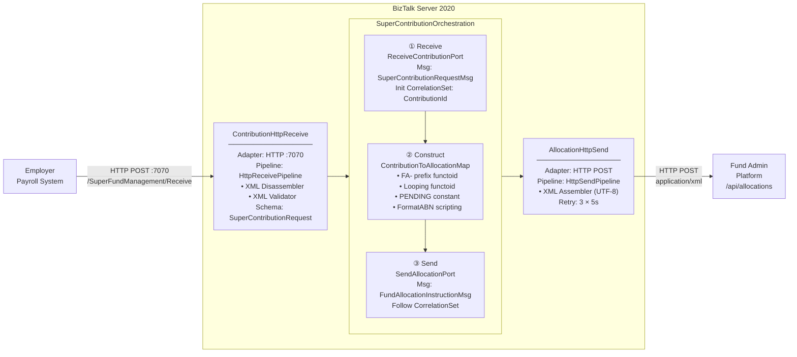

# BizTalk Orchestration: SuperFundManagement

## Overview

The `SuperContributionOrchestration` is a BizTalk Server 2020 orchestration that implements a one-way message flow. It receives an HTTP POST containing an XML `SuperContributionRequest` from an employer's payroll system, transforms it to a `FundAllocationInstruction` XML document using a BizTalk map, and forwards the result to the fund administration platform.


---

## Architecture



---

## Receive Port Configuration

**Port Name:** `ContributionHttpReceive`

| Property             | Value                                 |
|----------------------|---------------------------------------|
| Adapter              | HTTP                                  |
| Direction            | Receive                               |
| URL                  | `/SuperFundManagement/Receive`        |
| IIS Port             | 7070                                  |
| Pipeline             | `HttpReceivePipeline`                 |
| Message Schema       | `SuperContribution.SuperContributionRequest` |
| Authentication       | Anonymous (extend for production)     |
| Receive Handler      | `BizTalkServerApplication`            |

The HTTP receive adapter is hosted inside IIS via the `BTSHTTPReceive.dll` ISAPI extension. The IIS virtual directory must be configured on port 7070.

---

## Schema Descriptions

### Source Schema: `SuperContributionSchema.xsd`

Namespace: `http://SuperFundManagement.Schemas.SuperContribution`
Root Element: `SuperContributionRequest`

| Field                              | Type     | Notes                                        |
|------------------------------------|----------|----------------------------------------------|
| `ContributionId`                   | string   | Unique contribution batch identifier         |
| `EmployerId`                       | string   | Employer account number                      |
| `EmployerName`                     | string   | Legal name of the employer                   |
| `EmployerABN`                      | string   | Australian Business Number (11 digits)       |
| `PayPeriodEndDate`                 | date     | Pay period end date (ISO 8601)               |
| `Members/Member[+]`                | sequence | One or more member contributions             |
| `Members/Member/MemberAccountNumber` | string | Super fund member account number             |
| `Members/Member/MemberName`        | string   | Full name of the member                      |
| `Members/Member/ContributionType`  | string   | `SuperannuationGuarantee`, `VoluntaryEmployee`, or `VoluntaryEmployer` |
| `Members/Member/GrossAmount`       | decimal  | Contribution amount in AUD                   |
| `TotalContribution`                | decimal  | Sum of all member GrossAmount values         |
| `Currency`                         | string   | Default: `AUD`                               |
| `PaymentReference`                 | string   | Payment reference for reconciliation         |

### Target Schema: `FundAllocationSchema.xsd`

Namespace: `http://SuperFundManagement.Schemas.FundAllocation`
Root Element: `FundAllocationInstruction`

| Field                                        | Type     | Notes                                      |
|----------------------------------------------|----------|--------------------------------------------|
| `AllocationId`                               | string   | System-assigned, prefixed `FA-`            |
| `SourceContributionRef`                      | string   | Original ContributionId for traceability   |
| `EmployerDetails/EmployerId`                 | string   |                                            |
| `EmployerDetails/EmployerName`               | string   |                                            |
| `EmployerDetails/ABN`                        | string   |                                            |
| `AllocationDate`                             | date     | Copied from `PayPeriodEndDate`             |
| `MemberAllocations/Allocation[+]`            | sequence |                                            |
| `MemberAllocations/Allocation/AccountNumber` | string   |                                            |
| `MemberAllocations/Allocation/MemberName`    | string   |                                            |
| `MemberAllocations/Allocation/ContributionType` | string |                                           |
| `MemberAllocations/Allocation/ContributionAmount` | decimal |                                        |
| `MemberAllocations/Allocation/AllocationStatus` | string | Default: `PENDING`                       |
| `TotalAllocated`                             | decimal  |                                            |
| `CurrencyCode`                               | string   |                                            |
| `Status`                                     | string   | Default: `PENDING`                         |

---

## Map: ContributionToAllocationMap

**File:** `Maps/ContributionToAllocationMap.btm`

### Transformation Rules

| Source Field                        | Target Field                              | Transformation Logic                               |
|-------------------------------------|-------------------------------------------|----------------------------------------------------|
| `ContributionId`                    | `AllocationId`                            | **String Concatenate Functoid**: `"FA-"` + `ContributionId` |
| `ContributionId`                    | `SourceContributionRef`                   | Direct link                                        |
| `EmployerId`                        | `EmployerDetails/EmployerId`              | Direct link                                        |
| `EmployerName`                      | `EmployerDetails/EmployerName`            | Direct link                                        |
| `EmployerABN`                       | `EmployerDetails/ABN`                     | Direct link                                        |
| `PayPeriodEndDate`                  | `AllocationDate`                          | Direct link                                        |
| `Members/Member` *(loop)*           | `MemberAllocations/Allocation`            | **Looping Functoid**                               |
| `Member/MemberAccountNumber`        | `Allocation/AccountNumber`                | Direct link (within loop)                          |
| `Member/MemberName`                 | `Allocation/MemberName`                   | Direct link (within loop)                          |
| `Member/ContributionType`           | `Allocation/ContributionType`             | Direct link (within loop)                          |
| `Member/GrossAmount`                | `Allocation/ContributionAmount`           | Direct link (within loop)                          |
| *(constant)*                        | `Allocation/AllocationStatus`             | **Constant Functoid**: value = `"PENDING"`         |
| `TotalContribution`                 | `TotalAllocated`                          | Direct link                                        |
| `Currency`                          | `CurrencyCode`                            | Direct link                                        |
| *(constant)*                        | `Status`                                  | **Constant Functoid**: value = `"PENDING"`         |

---

## Orchestration Flow

The orchestration is defined in `Orchestrations/SuperContributionOrchestration.odx`.

### Step-by-Step

1. **Receive** – The orchestration activates when a message arrives on `ReceiveContributionPort`.
   - Message type: `SuperFundManagement.Schemas.SuperContribution.SuperContributionRequest`
   - Correlation set initialized on `ContributionId` property

2. **Construct** – A `ConstructMessage` shape creates `FundAllocationInstructionMsg`.
   - Contains a `Transform` shape that applies `ContributionToAllocationMap`
   - Input: `SuperContributionRequestMsg`
   - Output: `FundAllocationInstructionMsg` (type `FundAllocationInstruction`)

3. **Send** – The `SendFundAllocationInstruction` shape publishes `FundAllocationInstructionMsg`.
   - Bound to `SendAllocationPort`
   - Follows the existing correlation set

### Message Declarations

| Message Name                    | Type                                               | Role     |
|---------------------------------|----------------------------------------------------|----------|
| `SuperContributionRequestMsg`   | `SuperContribution.SuperContributionRequest`       | Inbound  |
| `FundAllocationInstructionMsg`  | `FundAllocation.FundAllocationInstruction`         | Outbound |

---

## Send Port Configuration

**Port Name:** `AllocationHttpSend`

| Property        | Value                                              |
|-----------------|----------------------------------------------------|
| Adapter         | HTTP                                               |
| URL             | `http://fund-admin-platform/api/allocations`       |
| Content-Type    | `application/xml`                                  |
| Pipeline        | `HttpSendPipeline`                                 |
| Map             | `ContributionToAllocationMap`                      |
| Retry Count     | 3                                                  |
| Retry Interval  | 5 seconds                                          |
| Filter          | `BTS.ReceivePortName == ContributionHttpReceive`   |

---

## Binding and Deployment Notes

1. **Build** the solution in Visual Studio (Release configuration).
2. **Deploy** using BTSTask or via Visual Studio Deploy context menu.
3. **Import bindings** from `BindingFile.xml`:
   ```powershell
   BTSTask ImportBindings /ApplicationName:SuperFundManagement /Source:BindingFile.xml
   ```
4. **Start** the application from BizTalk Admin Console.
5. **Verify** the receive location is enabled and the IIS virtual directory is configured on port 7070.
6. **Test** by sending a sample XML POST to `http://localhost:7070/SuperFundManagement/Receive`.
