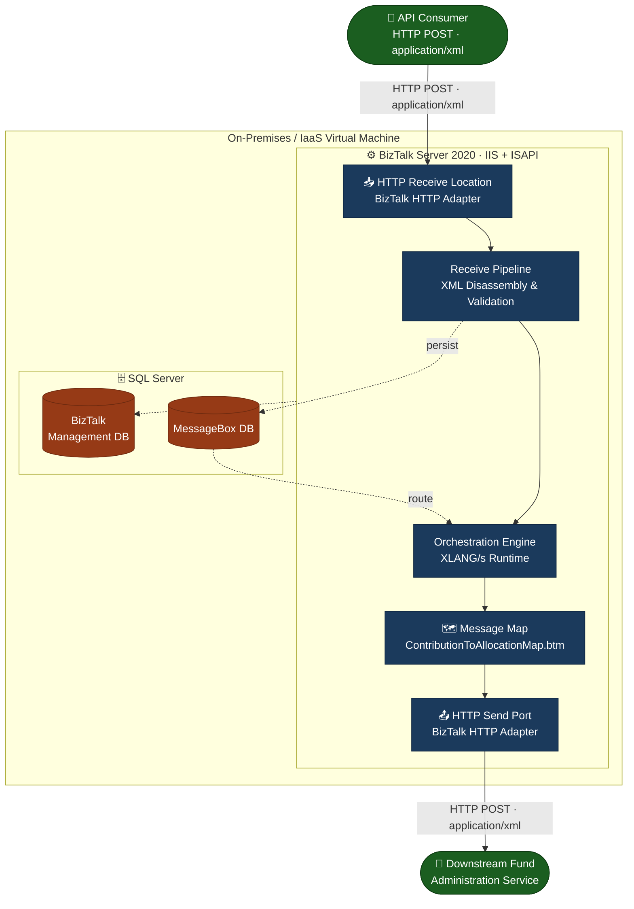
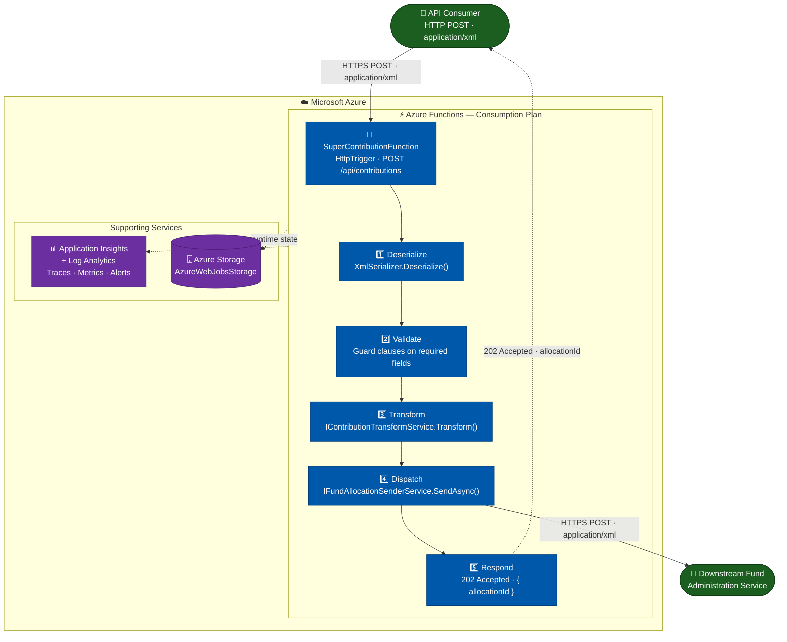

# Architecture: BizTalk to Azure Functions

## Current State: BizTalk Server 2020

### Overview

The current superannuation fund management solution runs on **BizTalk Server 2020** — Microsoft's enterprise service bus and integration platform. It consists of tightly coupled components managed through the BizTalk Administration Console.

### Architecture Diagram

### Component Inventory

| Component                            | Technology                    | Purpose                                      |
|--------------------------------------|-------------------------------|----------------------------------------------|
| HTTP Receive Location                | BizTalk HTTP Adapter + IIS    | Inbound message ingestion                    |
| Receive Pipeline                     | `HttpReceivePipeline.btp`     | XML validation and disassembly               |
| MessageBox                           | SQL Server database           | Message persistence and routing              |
| Orchestration Engine                 | XLANG/s runtime               | Business process coordination                |
| Map                                  | `ContributionToAllocationMap.btm`   | XML transformation with functoids            |
| Send Pipeline                        | `HttpSendPipeline.btp`        | XML assembly and encoding                    |
| HTTP Send Port                       | BizTalk HTTP Adapter          | Outbound delivery                            |
| BizTalk Management DB                | SQL Server database           | Application metadata and bindings            |

---

## Target State: Azure Functions v4 / .NET 8

### Overview

The target solution runs as an **Azure Function** on the Consumption plan — fully serverless, with no persistent infrastructure to manage. The entire integration logic lives in a single, testable .NET 8 assembly.

### Architecture Diagram

### Component Inventory

| Component                        | Technology                       | Purpose                                      |
|----------------------------------|----------------------------------|----------------------------------------------|
| HTTP Trigger                     | `[HttpTrigger]` attribute        | Inbound message ingestion                    |
| XML Deserialization              | `System.Xml.Serialization`       | Parse incoming `SuperContribution` XML             |
| Validation                       | C# guard clauses                 | Reject malformed or incomplete orders        |
| Transformation                   | `ContributionTransformService`          | Map `SuperContribution` → `FundAllocation`       |
| HTTP Dispatch                    | `FundAllocationSenderService`       | POST to downstream fund administration platform       |
| Configuration                    | Azure App Settings               | `FulfillmentServiceUrl` and other secrets    |
| Observability                    | Application Insights SDK         | Distributed tracing, metrics, alerting       |
| Storage                          | Azure Blob Storage               | Function runtime host management             |
| IaC                              | Bicep modules                    | Repeatable infrastructure deployment         |

---

## Technology Comparison

| Dimension                | BizTalk Server 2020                        | Azure Functions v4 (.NET 8)                |
|--------------------------|--------------------------------------------|--------------------------------------------|
| **Hosting**              | Windows Server VM (on-prem or IaaS)        | Serverless (Consumption plan)              |
| **Language**             | XLANG/s orchestration + C# components      | C# (.NET 8 isolated)                       |
| **Transformation**       | BizTalk Mapper (.btm) + XSLT               | LINQ + C# object mapping                  |
| **Configuration**        | Binding files + BizTalk Admin Console      | App Settings + `local.settings.json`       |
| **Deployment**           | MSI + BTSTask + Admin Console              | `az functionapp deployment source config-zip` |
| **CI/CD**                | Manual or custom scripts (complex)         | GitHub Actions / Azure DevOps (standard)   |
| **Testing**              | BizTalk Unit Test Framework (limited)      | xUnit + Moq (standard .NET)               |
| **Observability**        | BizTalk Admin Group Hub + SQL queries      | Application Insights + Log Analytics       |
| **Source Control**       | Binary .btm, .odx files (poor diffability) | Plain C# text files                        |
| **Scalability**          | Manual (add BizTalk servers to group)      | Automatic (0 to N instances instantly)     |
| **Cost Model**           | Per-server license + VM + SQL              | Per-execution (~$0.20/1M)                  |

---

## Non-Functional Requirements Comparison

### Latency

| Scenario                        | BizTalk                         | Azure Functions                   |
|---------------------------------|---------------------------------|-----------------------------------|
| Message processing time         | 200–800ms (MessageBox overhead) | 50–200ms (in-process, cold start excluded) |
| Cold start (first request)      | N/A (always warm)               | 1–3 seconds (Consumption plan)    |
| Warm throughput                 | ~200 msg/sec per server         | 1,000+ req/sec auto-scaled        |

> **Note:** For latency-sensitive scenarios requiring sub-100ms consistently, consider Premium or Dedicated App Service plan for Azure Functions to eliminate cold starts.

### Throughput

| Scenario                        | BizTalk                         | Azure Functions                   |
|---------------------------------|---------------------------------|-----------------------------------|
| Peak throughput                 | Limited by MessageBox SQL IOPS  | Auto-scales horizontally          |
| Burst handling                  | Queue-backed (handles smoothly) | Burst to 200 instances in seconds |
| Backpressure                    | MessageBox queuing              | Configure max instance count      |

### High Availability

| Dimension                       | BizTalk                                    | Azure Functions                            |
|---------------------------------|--------------------------------------------|--------------------------------------------|
| Architecture                    | BizTalk Server Group (active-active)       | Azure platform-managed HA                 |
| SLA                             | ~99.9% (with clustering)                   | 99.95% (Consumption), 99.99% (Premium)    |
| Failover                        | Manual or NLB-based                        | Automatic (Azure infrastructure)           |
| Disaster recovery               | SQL Always On + BizTalk group replication  | Azure Paired Regions + Traffic Manager     |
| Maintenance windows             | Required for updates                       | Zero-downtime rolling updates             |
